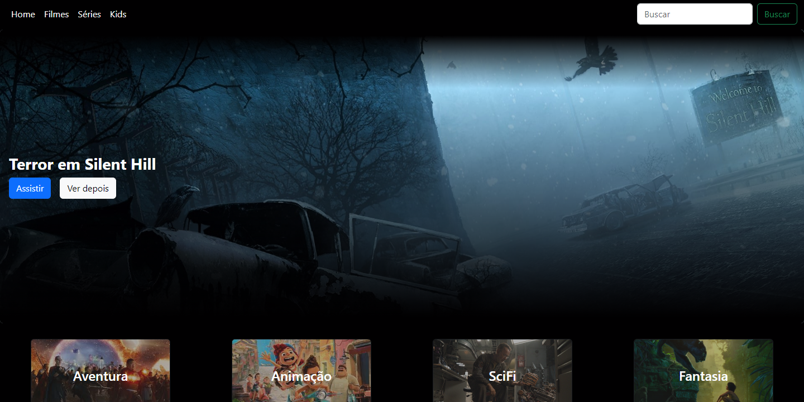
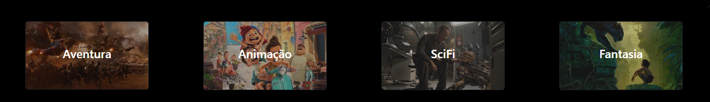
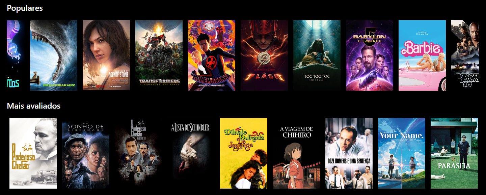

# Nome do projeto




> A parte inicial do site é composta por um Topbar com links de navegação e um input de pesquisa com redirecionamento para página explorar. O banner é dinâmico mudando a cada atualização da página.



> Em seguida quatro cards com efeito hover, mudando o background para um gif.



> Em seguida a lista de filmes dentro de um carousel, com slide usando egjs conveyer (https://naver.github.io/egjs-conveyer/). Infelizmente o uso dela e junto de algumas propriedades css gerou um bug que o scroll-y não acontece quando o mouse está sobre o carrossel.

## 💻 Pré-requisitos

Antes de começar, verifique se você atendeu aos seguintes requisitos:

* Você instalou a versão mais recente de `Node 16.x.x ou maior`
* Caso deseje usar Docker, existe os arquivos `Dockerfile` e `docker.compose.yml`.


## 🚀 Instalando

Para instalar o projeto, siga estas etapas:

```
npm install
```

Ver localmente:
```
ng serve
```

E acesse http://localhost:4200


Usando docker
```
npm run docker-compose
```

E acesse http://localhost:8081
